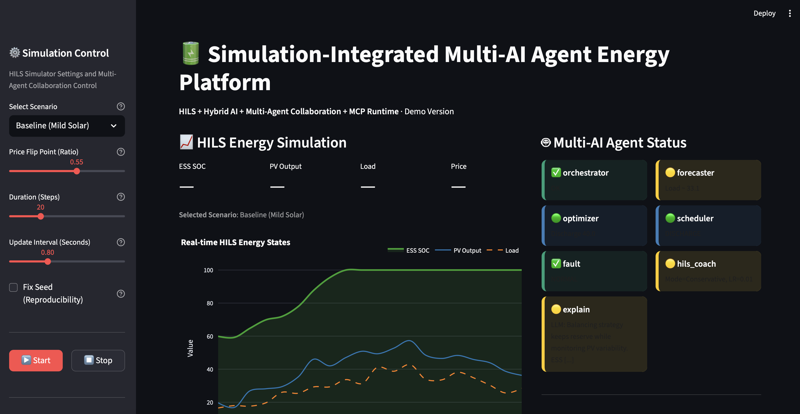
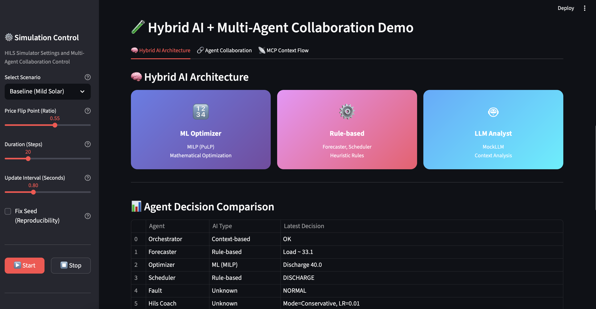
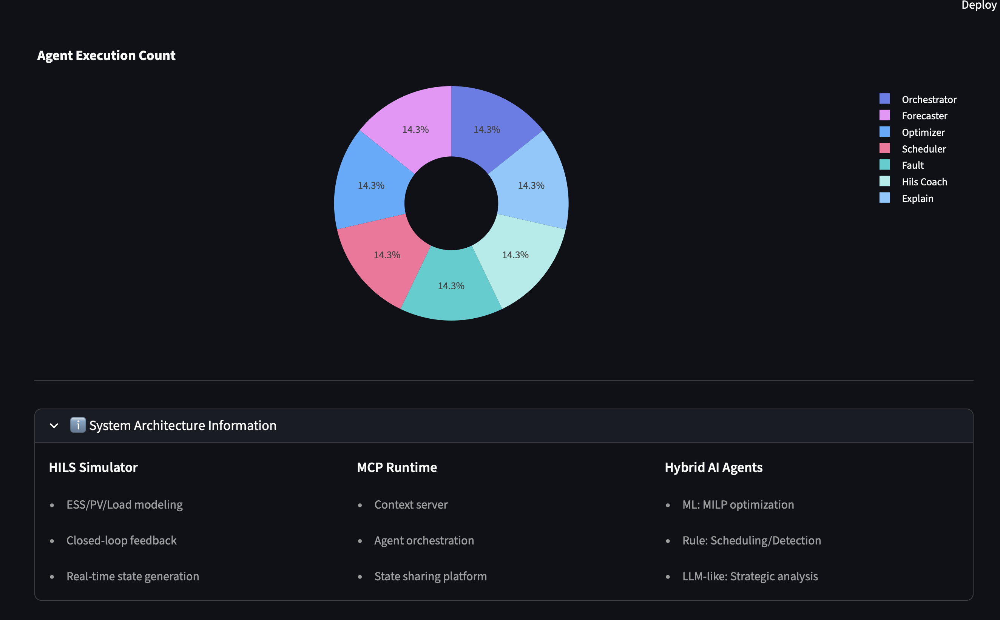
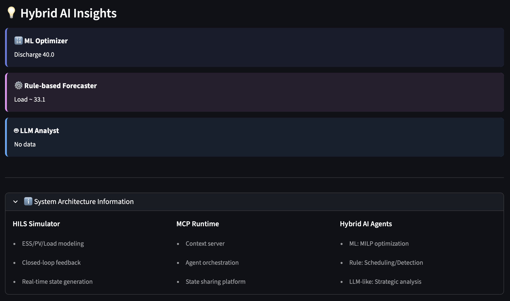
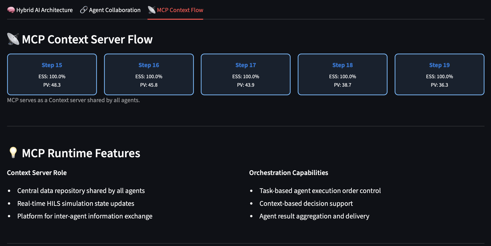

# Simulation-Integrated Multi-AI Agent Energy Platform (Demo)

[](https://www.python.org/)
[](https://streamlit.io/)
[](https://plotly.com/)
[](https://coin-or.github.io/pulp/)
[](LICENSE)

**HILS + Multi-Agent + Hybrid AI + MCP Runtime based Energy Management Visualization Demo**

## 📸 Screenshots

### Main Dashboard

*Real-time HILS energy simulation with 6 AI agents status monitoring*

### Hybrid AI Architecture

*ML + Rule-based + LLM three-tier architecture visualization*

### Agent Collaboration Timeline

*Multi-agent decision flow and collaboration patterns*

### Agent Execution Distribution

*Activity distribution across different AI agents*

### Hybrid AI Insights

*Real-time insights from ML Optimizer, Rule-based Forecaster, and LLM Analyst*

### MCP Context Flow

*Context server data flow showing shared state across agents*

---

## 🎯 Project Purpose

This project is a **demonstration platform** showcasing advanced energy management technologies:

- **HILS (Hardware-in-the-Loop Simulation)** based closed-loop simulator
- **ML + LLM Hybrid AI** agent architecture
- **Multi-Agent Collaboration** framework
- **MCP (Model Context Protocol)** based Context server structure
- **DER (PV/ESS/EV) management and optimization** workflow visualization
- **Real-time visualization** with Streamlit UI

> **Core Concept**: A demo UI that visually demonstrates how energy optimization AI works without requiring an actual EMS system

## 📁 Project Structure

```bash
smartEMS/
├── app.py                          # Main Streamlit application entry point
├── requirements.txt                # Python dependencies
├── README.md                       # Project documentation
│
├── src/                            # Source code directory
│   ├── __init__.py
│   ├── agents/                     # AI agent modules
│   │   ├── __init__.py
│   │   └── agents.py               # All AI agents (Forecaster, Optimizer, etc.)
│   ├── core/                       # Core system components
│   │   ├── __init__.py
│   │   ├── simulator.py            # HILS-based simulator
│   │   └── mcp_core.py             # MCP Runtime (Context + Orchestration)
│   └── ui/                         # UI components
│       ├── __init__.py
│       ├── ui_components.py        # Reusable UI components (charts, cards, logs)
│       ├── hybrid_ai_ui.py         # Hybrid AI + Collaboration visualization
│       └── utils.py                # Utility functions (logging, state management)
│
└── tests/                          # Test directory
    ├── __init__.py
    └── test_system.py              # Unit tests (17 tests, 100% pass rate)
```

## 🔄 System Workflow

```
[HILS Simulator] 
    ↓ Calculate and generate ESS/PV/Load values
[MCP Runtime]
    ↓ Update context (time, ess_level, pv_output, load, price, etc.)
[Multi-AI Agents]
    ├─ Forecaster: Load/weather prediction
    ├─ Optimizer: MILP optimization
    ├─ Scheduler: Charge/discharge policy determination
    ├─ Fault Detection: Anomaly detection
    ├─ Orchestrator: Agent invocation order management
    └─ HILS Coach: HILS learning/tuning parameter calculation
[UI / Visualization]
    └─ Real-time energy graphs + Agent status dashboard + Log stream
```

## 🏗️ Core Technology Components

1. **HILS-based Closed-loop Structure**: Real-time feedback loop for control algorithm verification
2. **ML + LLM Hybrid AI Agents**: Combination of rule-based + optimization + LLM-style analysis
3. **Multi-Agent Collaboration**: 6 agents collaborating through shared context
4. **Context Server-based MCP Structure**: Platform for sharing state/history between agents
5. **DER Control Flow**: Integrated optimization of PV/ESS/EV
6. **Extensible Tool Gateway Structure**: Support for Modbus/OPC-UA integration (mocked in demo)

## 🚀 Quick Start

### Installation

```bash
cd smartEMS
pip install -r requirements.txt
```

### Execution

```bash
streamlit run app.py
```

Browser will automatically open at `http://localhost:8501`

### Testing

```bash
python -m pytest tests/test_system.py -v
```

All tests passing: **17/17** ✅

## 🤖 Agent Architecture

### 6 Core Agents

| Agent | Role | Technology |
|-------|------|------------|
| **ForecasterAgent** | Load/weather prediction | Stochastic modeling |
| **OptimizerAgent** | ESS charge/discharge optimization | MILP (PuLP) / Heuristic fallback |
| **SchedulerAgent** | Charge/discharge scheduling | Rule-based + SoC/ToU |
| **FaultDetectionAgent** | PV/ESS anomaly detection | Threshold-based detection |
| **HILSCoachAgent** | Learning parameter adjustment | Adaptive parameter tuning |
| **OrchestratorAgent** | Agent invocation management | Orchestration pattern |

### Hybrid AI Structure

- **ML-based**: MILP optimization (Optimizer)
- **Rule-based**: Scheduling, anomaly detection
- **LLM-like**: MockLLMAgent (strategic analysis)

## 🎨 UI Structure

```
┌─────────────────────────────────────────────────┐
│  Sidebar: Simulation Control                    │
│  - Scenario selection                           │
│  - Step length / speed adjustment               │
│  - Start / Stop buttons                         │
└─────────────────────────────────────────────────┘

┌────────────────────────┬────────────────────────┐
│  Left: HILS Simulation │  Right Top: Agent Status│
│  - ESS SOC graph       │  - 6 agent cards        │
│  - PV Output           │  - Status icons         │
│  - Load                │                         │
│                        ├────────────────────────┤
│                        │  Right Bottom: Live Logs│
│                        │  - Step-by-step metrics │
│                        │  - CSV download         │
└────────────────────────┴────────────────────────┘

┌─────────────────────────────────────────────────┐
│  Hybrid AI + Multi-Agent Collaboration Demo     │
│  ├─ Tab 1: Hybrid AI Architecture               │
│  │   - ML / Rule-based / LLM 3-tier visualization│
│  │   - Agent Decision Comparison Table          │
│  │   - Hybrid AI Insights Panel                 │
│  ├─ Tab 2: Agent Collaboration                  │
│  │   - Multi-Agent Decision Timeline Graph      │
│  │   - Agent Activity Distribution Pie Chart    │
│  └─ Tab 3: MCP Context Flow                     │
│      - MCP Context Updates (recent 5 steps)     │
│      - Context Server role explanation          │
└─────────────────────────────────────────────────┘
```

## 📊 Key Features

### Simulation Control
- **3 Scenarios**: Baseline / High Price Late Peak / Volatile Market
- **Customization**: Step length (5-60), speed (0.2-2.0s), price flip ratio
- **Reproducibility**: Fixed seed option

### Real-time Monitoring
- **Energy Charts**: ESS SOC, PV, Load (Plotly spline curves)
- **Agent Status**: Color coding (✅🟢🟡⚠️❌)
- **Live Logs**: Scrollable + CSV download
- **Metrics**: Real-time ESS/PV/Load/Price display

### Hybrid AI Demo (New)
- **AI Architecture Visualization**: ML/Rule-based/LLM 3-tier structure
- **Agent Decision Comparison**: AI type and recent decisions table for each agent
- **Collaboration Timeline**: Multi-agent decision flow graph
- **Activity Distribution**: Agent call count pie chart
- **MCP Context Flow**: Context server data flow visualization
- **Hybrid AI Insights**: Recent judgments from ML/Rule/LLM layers

## 🔧 Code Quality

### Documentation
- ✅ All modules/functions have docstrings
- ✅ Type hints
- ✅ Detailed comments

### Error Handling
- ✅ Try-except blocks
- ✅ Logging system
- ✅ Graceful degradation

### Testing
- ✅ 17 unit tests
- ✅ 100% pass rate
- ✅ Integration tests

## 📚 Module Roles

### src/core/simulator.py
- ESS charge level simulation
- PV output random modeling
- Load modeling
- HILS feedback loop support

### src/core/mcp_core.py
- Shared context storage for entire system
- Agent invocation and coordination (`orchestrate()`)
- MCP-like structure for state sharing between agents

### src/agents/agents.py
- Implementation of 6 agents
- Hybrid AI structure (ML + Rule + LLM-like)
- Context-based collaboration

### src/ui/ui_components.py
- Reusable UI components
- Charts, status cards, logs, metrics

### src/ui/hybrid_ai_ui.py
- Hybrid AI architecture visualization
- Multi-agent collaboration timeline
- MCP context flow display

### src/ui/utils.py
- Log formatting
- Session state management
- Helper functions

## 🐛 Troubleshooting

### PuLP Optimization Error
```bash
pip install pulp
```

### Streamlit Port Conflict
```bash
streamlit run app.py --server.port 8502
```

### Test Failures
```bash
pip install -r requirements.txt --force-reinstall
python -m pytest tests/test_system.py -v
```

## 📝 Development Guide

### Adding a New Agent
1. Add new Agent class to `src/agents/agents.py`
2. Inherit from `BaseAgent` and implement `run()` method
3. Add to agent dictionary in `app.py`
4. Add tests to `tests/test_system.py`

### Adding New UI Components
1. Create component function in `src/ui/ui_components.py` or `src/ui/hybrid_ai_ui.py`
2. Import and use in `app.py`
3. Follow existing naming conventions (render_* functions)

### Project Structure Guidelines
- `src/agents/`: All AI agent implementations
- `src/core/`: Core business logic (simulator, MCP)
- `src/ui/`: All UI-related components and utilities
- `tests/`: All test files with `test_` prefix
- Keep `app.py` as the main entry point, import from `src/`

### UI 수정 시
- 좌측 그래프: `ui_components.py` → `render_energy_chart()`
- 에이전트 카드: `ui_components.py` → `render_agent_status_cards()`
- 로그: `ui_components.py` → `render_live_logs()`

## 🎓 학습 순서

1. **README.md** 읽기 → 전체 개념 파악
2. **simulator.py** 보기 → HILS 시뮬레이션 로직
3. **src/agents/agents.py** - Understand each agent's role
4. **src/core/mcp_core.py** - Check MCP orchestration
5. **app.py** - Run and explore UI functionality

---

## 📄 License

**Custom License - Free for Personal Use, Commercial License Required**

This software is free to use for personal, educational, and non-commercial purposes. Commercial use requires a separate license agreement.

- ✅ **Free**: Personal use, education, research
- ❌ **Requires License**: Commercial use, production deployment, integration into commercial products

For commercial licensing inquiries, please contact: hyun.lim@okkorea.net

---

## 📞 Contact & Services

### Development Consulting & Outsourcing Available

We provide professional consulting and development services for IoT, AI, and embedded systems projects.

### 👨‍💼 Project Manager Contact

- **Email**: [hyun.lim@okkorea.net](mailto:hyun.lim@okkorea.net)
- **Homepage**: [https://www.okkorea.net](https://www.okkorea.net)
- **LinkedIn**: [https://www.linkedin.com/in/aionlabs/](https://www.linkedin.com/in/aionlabs/)

### 🛠️ Technical Expertise / 기술 전문 분야

- **IoT System Design and Development** / IoT 시스템 설계 및 개발
- **Embedded Software Development** / 임베디드 소프트웨어 개발 (Arduino, ESP32)
- **AI Service Development** / AI 서비스 개발 (LLM, MCP Agent)
- **Cloud Service Architecture** / 클라우드 서비스 구축 (Google Cloud Platform)
- **Hardware Prototyping** / 하드웨어 프로토타이핑

### 💼 Services / 서비스

- **Technical Consulting** / 기술 컨설팅
  - IoT project planning and design consultation / IoT 프로젝트 기획 및 설계 자문
  - System architecture design / 시스템 아키텍처 설계
  
- **Development Outsourcing** / 개발 외주
  - Full-stack development from firmware to cloud / 펌웨어부터 클라우드까지 Full-stack 개발
  - Proof of Concept (PoC) development / 개념 검증 개발
  - Production-ready system development / 상용 시스템 개발
